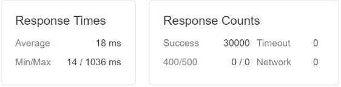
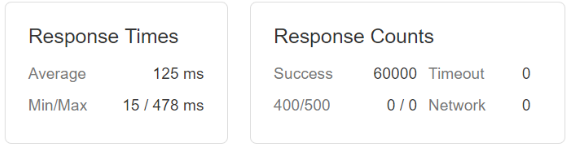
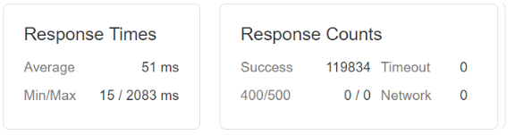

# StreetBreezy Description and Amenities Component
> An open-source StreetEasy clone of a description and amenities component, served as a microservice. The goal of this project was to optimize and scale the back-end of the service, without modifying any front-end code.

[Link to Deployed Service](http://3.18.222.154/13/)

## Context

For this project, I increased the load capacity of an existing microservice by extending the back-end operations and architecture to better handle web-scale traffic levels. Throughout this project, I was prohibited from modifying any of the existing front-end code to simulate the separation of concerns across the stack, and all refactored code must properly integrate with the original front-end after each push. 

Please reference the *Metrics* section to see more about the performance improvements with each modification. All metrics were collected using [Loader.io](loader.io)


## Getting Started

These instructions will get you a copy of the project up and running on your local machine for development and testing purposes.

*Before seeding the MongoDB instance with mock data, make sure to replace the mongoose connection IP address in db.js from `#.#.#.#` to `localhost` if running the service locally*

```js
// from root directory
  npm i  // install npm dependencies
  node ./kkServer/comboSeeder.js  // seed MongoDB with mock data
  npm run react-dev  // build bundle with webpack
  npm start  // start the server - listens on localhost:3009
```

## Built With

* ReactJS
* NodeJS/Express
* MongoDB
* Docker
* Nginx
* AWS


## Performance Metrics

### Baseline
* No modifications to codebase
* Max Capacity: 500 Requests per Second (RPS) for 1 minute


### Load Balanced Across 2 Services
* Set up an Nginx server in front of service servers
* Balanced requests across two service servers using the **"least connections"** algorithm
* Max Capacity: 1000 RPS

* Results: increased the average latency due to the extra network requests going through the load-balancer, but effectively doubled the load capacity of the service

### Load Balanced Across 4 Services
* Connected 2 additional service servers to load balancer (4 service servers total)
* Max Capacity: 2000 RPS

* Results: Additional servers reduced the average latency, and doubled the previous load capacity, as expected.


## Authors

* [Kevin Kim](https://github.com/qwaded13)